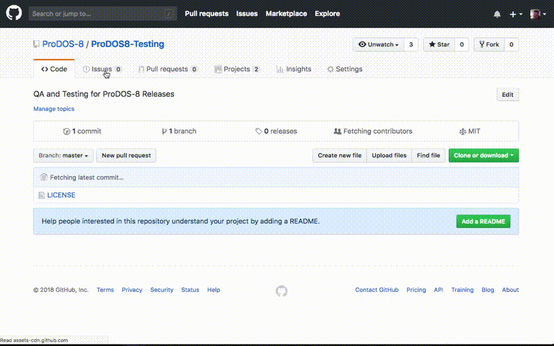

ProDOS-8 Testing
================

## Submitting an Issue / Bug Report

* Go to: https://github.com/ProDOS-8/ProDOS8-Testing/issues
* **Create an issue**
* **Label** the issue as a **bug**
* Set the **Project** to be the **ProDOS 2.4** or **ProDOS 2.5** major version release project.
* *Bugs for releases prior to version 2.4 can not be accepted.*

